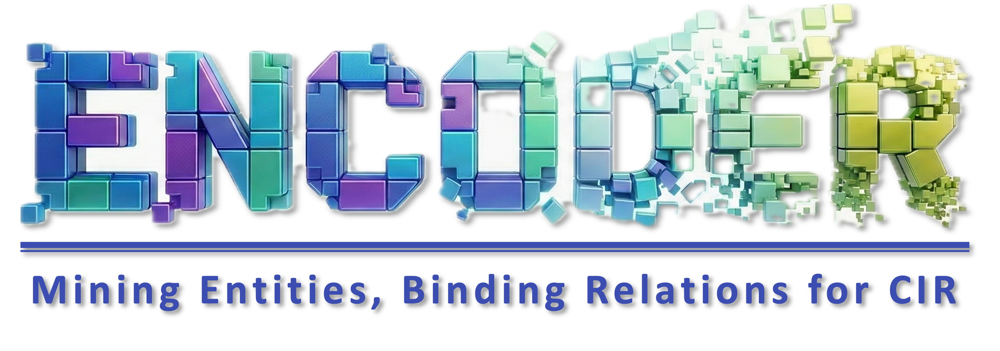
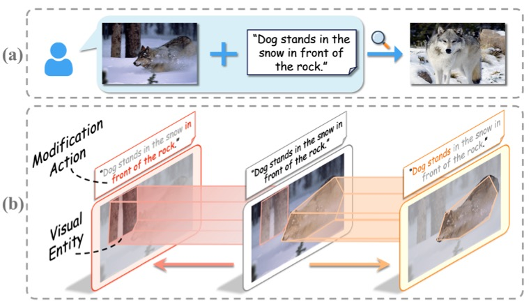
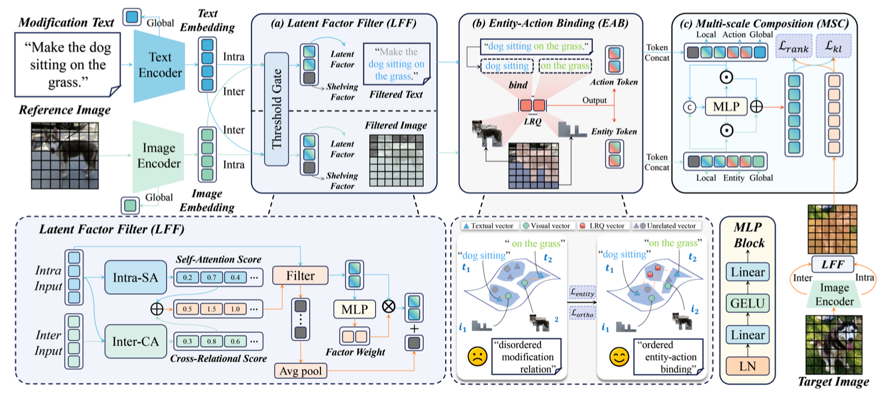
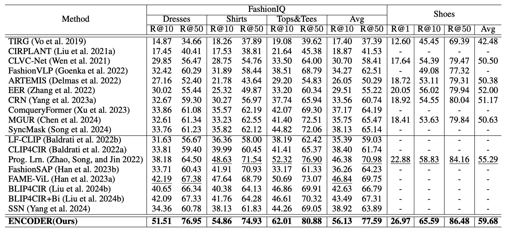
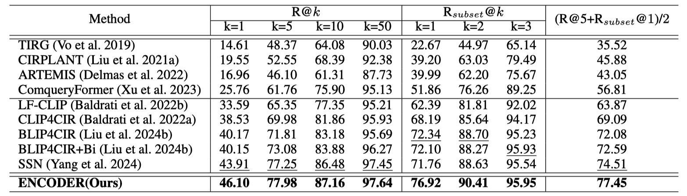

<a id="top"></a>
<div align="center">
   
  <h1>(AAAI 2025) ENCODER: Entity Mining and Modification Relation Binding for Composed Image Retrieval</h1>
  <!-- <p align="center">
  
</p> -->
  <div>
  <a target="_blank" href="https://lee-zixu.github.io/">Zixu&#160;Li</a><sup>1</sup>,
  <a target="_blank" href="https://zivchen-ty.github.io/">Zhiwei&#160;Chen</a><sup>1</sup>,
  <a target="_blank" href="https://haokunwen.github.io">Haokun&#160;Wen</a><sup>2,3</sup>,
  <a target="_blank" href="https://zhihfu.github.io/">Zhiheng&#160;Fu</a><sup>1</sup>,
  <a target="_blank" href="https://faculty.sdu.edu.cn/huyupeng1/zh_CN/index.htm">Yupeng&#160;Hu</a><sup>1&#9993</sup>,
  <a target="_blank" href="https://homepage.hit.edu.cn/guanweili">Weili&#160;Guan</a><sup>2</sup>
  </div>
  <sup>1</sup>School of Software, Shandong University &#160&#160&#160</span>  <br />
  <sup>2</sup>School of Computer Science and Technology, Harbin Institute of Technology (Shenzhen), &#160&#160&#160</span>  <br />
  <sup>2</sup>School of Data Science, City University of Hong Kong &#160&#160&#160</span>
  <br />
  <sup>&#9993&#160;</sup>Corresponding author&#160;&#160;</span>
  <br/>
  
  <p>
      <a href="https://aaai.org/Conferences/AAAI-25/"></a>
      <a href="https://ojs.aaai.org/index.php/AAAI/article/view/32541"></a>
      <a href="https://sdu-l.github.io/ENCODER.github.io/"></a>
      <a href="https://pytorch.org/get-started/locally/"></a>
      
      <a href="https://github.com/ZivChen-Ty/ENCODER"></a> 
  </p>

  <p>
    <b>Accepted by AAAI 2025:</b> A novel network designed to mine visual entities and modification actions, and bind implicit modification relations in Composed Image Retrieval (CIR).
  </p>
</div>

## 📌 Introduction
Welcome to the official repository for **ENCODER** (Entity miNing and modifiCation relation binDing nEtwoRk). 

Existing CIR approaches often struggle with the modification relation between visual entities and modification actions due to three main challenges: irrelevant factor perturbation, vague semantic boundaries, and implicit modification relations. **ENCODER** tackles these by explicitly mining entities and actions, and securely binding them through modality-shared queries, achieving State-of-the-Art (SOTA) performance across multiple datasets.

[⬆ Back to top](#top)

## 📢 News
* **[Mar 2026]** 🚀 All codes are transfered to the Github Repo.
* **[Oct 2025]** 🛠️ Based on feedback from some researchers, we found that different versions of open_clip can impact model performance. To ensure consistent performance, we have further clarified the environment dependencies (requirements.txt).
* **[Sep 2025]** 🛠️ We have updated the evaluation code and ENCODER checkpoints with "state_dict" version for stable evaluation.
* **[Apr 2025]** 🚀 We have released the full ENCODER code and checkpoints.
* **[Dec 2024]** 🔥 ENCODER has been accepted by **AAAI 2025**.

[⬆ Back to top](#top)

## ✨ Key Features
Our framework introduces three innovative modules to achieve precise multimodal semantic alignment:

* 🔍 **Latent Factor Filter (LFF)**: Filters out irrelevant visual and textual factors using a dynamic threshold gating mechanism, keeping only the latent factors highly related to modification semantics.
* 🔗 **Entity-Action Binding (EAB)**: Employs modality-shared Learnable Relation Queries (LRQ) to probe semantic boundaries. It dynamically mines visual entities and modification actions, learning their implicit relations to bind them effectively.
* 🧩 **Multi-scale Composition (MSC)**: Guided by the entity-action binding, this module performs multi-scale feature composition to precisely push the retrieved feature closer to the target image.
* 🏆 **SOTA Performance**: Demonstrates superior generalization and achieves remarkable improvements (e.g., +19.8% on FashionIQ-Avg R@10) across both fashion-domain and open-domain datasets.

[⬆ Back to top](#top)

## 🏗️ Architecture

<p align="center">
  
  <figcaption><strong>Figure 1.</strong> The overall architecture of ENCODER. It processes the reference image and modification text through LFF, binds entities and actions via EAB, and finally aggregates features in the MSC module.</figcaption>
</p>

[⬆ Back to top](#top)

## 📊 Experiment Results

ENCODER consistently outperforms existing baselines on four widely-used datasets.

### 1. FashionIQ & Shoes Datasets
*(Evaluated using Recall@K)* 
<p align="center">
  
</p>

### 2. CIRR Dataset
*(Evaluated using R@K and R_subset@K)* 
<p align="center">
  
</p>

[⬆ Back to top](#top)

---

## 📑 Table of Contents

- [📌 Introduction](#-introduction)
- [📢 News](#-news)
- [✨ Key Features](#-key-features)
- [🏗️ Architecture](#️-architecture)
- [📊 Experiment Results](#-experiment-results)
  - [1. FashionIQ & Shoes Datasets](#1-fashioniq--shoes-datasets)
  - [2. CIRR Dataset](#3-cirr-dataset)
- [🚀 Installation](#-installation)
- [📂 Data Preparation](#-data-preparation)
  - [Shoes](#shoes)
  - [FashionIQ](#fashioniq)
  - [Fashion200K](#fashion200k)
  - [CIRR](#cirr)
- [🏃‍♂️ Quick Start](#️-quick-start)
  - [1. Training the Model](#1-training-the-model)
  - [2. Evaluating the Model](#2-evaluating-the-model)
  - [3. Test for CIRR](#3-test-for-cirr)
- [🧩 Project Structure](#-project-structure)
- [📝 Citation](#-citation)
- [🤝 Acknowledgements](#-acknowledgements)
- [✉️ Contact](#️-contact)

---

## 🚀 Installation

**1. Clone the repository**
```bash
git clone [https://github.com/YourUsername/ENCODER.git](https://github.com/YourUsername/ENCODER.git)
cd ENCODER
```
**2. Setup Environment**
We recommend using Conda to manage your environment:
```bash
conda create -n encoder_env python=3.9
conda activate encoder_env

# Install PyTorch (Ensure it matches your CUDA version)
pip install torch torchvision torchaudio --index-url [https://download.pytorch.org/whl/cu118](https://download.pytorch.org/whl/cu118)

# Install required packages
pip install -r requirements.txt
```
## 📂 Data Preparation
ENCODER is evaluated on FashionIQ, Shoes, Fashion200K, and CIRR. Please download the datasets from their official sources and arrange them as follows. (You can modify the paths in datasets.py if needed).
#### Shoes

Download the Shoes dataset following the instructions in
the [official repository](https://github.com/XiaoxiaoGuo/fashion-retrieval/tree/master/dataset).

After downloading the dataset, ensure that the folder structure matches the following:

```
├── Shoes
│   ├── captions_shoes.json
│   ├── eval_im_names.txt
│   ├── relative_captions_shoes.json
│   ├── train_im_names.txt
│   ├── [womens_athletic_shoes | womens_boots | ...]
|   |   ├── [0 | 1]
|   |   ├── [img_womens_athletic_shoes_375.jpg | descr_womens_athletic_shoes_734.txt | ...]

```

#### FashionIQ

Download the FashionIQ dataset following the instructions in
the [official repository](https://github.com/XiaoxiaoGuo/fashion-iq).

After downloading the dataset, ensure that the folder structure matches the following:

```
├── FashionIQ
│   ├── captions
|   |   ├── cap.dress.[train | val | test].json
|   |   ├── cap.toptee.[train | val | test].json
|   |   ├── cap.shirt.[train | val | test].json

│   ├── image_splits
|   |   ├── split.dress.[train | val | test].json
|   |   ├── split.toptee.[train | val | test].json
|   |   ├── split.shirt.[train | val | test].json

│   ├── dress
|   |   ├── [B000ALGQSY.jpg | B000AY2892.jpg | B000AYI3L4.jpg |...]

│   ├── shirt
|   |   ├── [B00006M009.jpg | B00006M00B.jpg | B00006M6IH.jpg | ...]

│   ├── toptee
|   |   ├── [B0000DZQD6.jpg | B000A33FTU.jpg | B000AS2OVA.jpg | ...]
```

#### Fashion200K

Download the Fashion200K dataset following the instructions in
the [official repository](https://github.com/xthan/fashion-200k.git).

After downloading the dataset, ensure that the folder structure matches the following:

```
├── Fashion200K
│   ├── test_queries.txt

│   ├── labels
|   |   ├── dress_[train | test]_detect_all.txt
|   |   ├── jacket_[train | test]_detect_all.txt
|   |   ├── pants_[train | test]_detect_all.txt
|   |   ├── skirt_[train | test]_detect_all.txt
|   |   ├── top_[train | test]_detect_all.txt

│   ├── women
|   |   ├── [dresses | jackets | pants | skirts | tops]
```


#### CIRR

Download the CIRR dataset following the instructions in the [official repository](https://github.com/Cuberick-Orion/CIRR).

After downloading the dataset, ensure that the folder structure matches the following:

```
├── CIRR
│   ├── train
|   |   ├── [0 | 1 | 2 | ...]
|   |   |   ├── [train-10108-0-img0.png | train-10108-0-img1.png | ...]

│   ├── dev
|   |   ├── [dev-0-0-img0.png | dev-0-0-img1.png | ...]

│   ├── test1
|   |   ├── [test1-0-0-img0.png | test1-0-0-img1.png | ...]

│   ├── cirr
|   |   ├── captions
|   |   |   ├── cap.rc2.[train | val | test1].json
|   |   ├── image_splits
|   |   |   ├── split.rc2.[train | val | test1].json
```

## 🏃‍♂️ Quick Start
### 1. Training the Model
To train ENCODER from scratch, use the train.py script. By default, it uses the AdamW optimizer with a learning rate of 5e-5 for the main network and 1e-6 for the CLIP backbone.
```
python train.py \
    --dataset cirr \
    --data_path ./data/cirr \
    --batch_size 128 \
    --epochs 10 \
    --lr 5e-5 \
    --output_dir ./checkpoints/encoder_cirr
```

### 2. Evaluating the Model
Our checkpoints are released at [Google Drive](https://drive.google.com/drive/folders/1QuBQVIybLwn-qFSORhpBsnXy6ebhtNr3). 
To test your trained model on the validation set, use the evaluate_model.py or test.py script:
```
python3 evaluation_model.py 
--model_dir checkpoints/ENCODER_{Shoes,FashionIQ,Fashion200K,CIRR}.pth 
--dataset {shoes, fashioniq, fashion200k, cirr}
--cirr_path ""
--fashioniq_path ""
--shoes_path ""
--fashion200k_path ""
```

### 3. Test for CIRR
To generate the predictions file for uploading on the [CIRR Evaluation Server](https://cirr.cecs.anu.edu.au/) using the our model, please execute the following command:

```sh
python src/cirr_test_submission.py model_path
```
```
model_path <str> : Path of the ENCODER checkpoint on CIRR, e.g. "checkpoints/ENCODER_CIRR.pt"
```

## 🧩 Project Structure
```
ENCODER/
├── train.py                 # 🚂 Main training loop and optimization [Eq. 16]
├── test.py                  # 🧪 General testing & inference logic
├── evaluate_model.py        # 📊 Script to calculate R@K metrics
├── cirr_test_submission.py  # 📤 Generates JSON files for CIRR server evaluation
├── datasets.py              # 🗂️ Dataloaders for FashionIQ, CIRR, etc.
├── utils.py                 # 🛠️ Helper functions, logging, and metric tracking
├── token_wise_matching.py   # 🔗 Implementation of Entity-Action Binding & LRQ
├── model_try2.py            # 🧠 Core ENCODER network architecture (LFF, EAB, MSC)
└── requirements.txt         # 📦 Project dependencies
```

## 📝 Citation
If you find this code or our paper useful for your research, please consider citing it 🥰:
```
@inproceedings{ENCODER,
  title={Encoder: Entity mining and modification relation binding for composed image retrieval},
  author={Li, Zixu and Chen, Zhiwei and Wen, Haokun and Fu, Zhiheng and Hu, Yupeng and Guan, Weili},
  booktitle={Proceedings of the AAAI Conference on Artificial Intelligence},
  volume={39},
  number={5},
  pages={5101--5109},
  year={2025}
}
```

## 🤝 Acknowledgements
The implementation of this project references the [CLIP4Cir](https://github.com/ABaldrati/CLIP4Cir) framework. We express our sincere gratitude to these open-source contributions\!

## ✉️ Contact
If you have any questions, feel free to [open an issue](https://github.com/Lee-zixu/ENCODER/issues) or contact us at:
* Zixu Li: lzx@mail.sdu.edu.cn


## 🔗 Related Projects

*Ecosystem & Other Works from our Team*

<table style="width:100%; border:none; text-align:center; background-color:transparent;">
  <tr style="border:none;">
    <td style="width:30%; border:none; vertical-align:top; padding-top:30px;">
      <br>
      <b>TEMA (ACL'26)</b><br>
      <span style="font-size: 0.9em;">
        <a href="https://arxiv.org/abs/2604.21806" target="_blank">Paper</a> | 
        <a href="https://lee-zixu.github.io/TEMA.github.io/" target="_blank">Web</a> | 
        <a href="https://github.com/Lee-zixu/ACL26-TEMA" target="_blank">Code</a>
      </span>
    </td>
    <td style="width:30%; border:none; vertical-align:top; padding-top:30px;">
      <br>
      <b>ConeSep (CVPR'26)</b><br>
      <span style="font-size: 0.9em;">
        <a href="https://arxiv.org/abs/2604.20358" target="_blank">Paper</a> | 
        <a href="https://lee-zixu.github.io/ConeSep.github.io/" target="_blank">Web</a> | 
        <a href="https://github.com/lee-zixu/ConeSep" target="_blank">Code</a>
      </span>
    </td>
     <td style="width:30%; border:none; vertical-align:top; padding-top:30px;">
      <br>
      <b>Air-Know (CVPR'26)</b><br>
      <span style="font-size: 0.9em;">
        <a href="https://arxiv.org/abs/2604.19386" target="_blank">Paper</a> | 
        <a href="https://zhihfu.github.io/Air-Know.github.io/" target="_blank">Web</a> | 
        <a href="https://github.com/zhihfu/Air-Know" target="_blank">Code</a>
      </span>
    </td>
  </tr>    
  <tr style="border:none;">
    <td style="width:30%; border:none; vertical-align:top; padding-top:30px;">
      <br>
      <b>HABIT (AAAI'26)</b><br>
      <span style="font-size: 0.9em;">
        <a href="https://ojs.aaai.org/index.php/AAAI/article/view/37608" target="_blank">Paper</a> | 
        <a href="https://lee-zixu.github.io/HABIT.github.io/" target="_blank">Web</a> | 
        <a href="https://github.com/Lee-zixu/HABIT" target="_blank">Code</a>
      </span>
    </td>
    <td style="width:30%; border:none; vertical-align:top; padding-top:30px;">
      <br>
      <b>ReTrack (AAAI'26)</b><br>
      <span style="font-size: 0.9em;">
        <a href="https://ojs.aaai.org/index.php/AAAI/article/view/39507" target="_blank">Paper</a> | 
        <a href="https://lee-zixu.github.io/ReTrack.github.io/" target="_blank">Web</a> | 
        <a href="https://github.com/Lee-zixu/ReTrack" target="_blank">Code</a>
      </span>
    </td>
    <td style="width:30%; border:none; vertical-align:top; padding-top:30px;">
      <br>
      <b>INTENT (AAAI'26)</b><br>
      <span style="font-size: 0.9em;">
        <a href="https://ojs.aaai.org/index.php/AAAI/article/view/39181" target="_blank">Paper</a> | 
        <a href="https://zivchen-ty.github.io/INTENT.github.io/" target="_blank">Web</a> | 
        <a href="https://github.com/ZivChen-Ty/INTENT" target="_blank">Code</a>
      </span>
    </td>  
    </tr>
  <tr style="border:none;">
    <td style="width:30%; border:none; vertical-align:top; padding-top:30px;">
      <br>
      <b>HUD (ACM MM'25)</b><br>
      <span style="font-size: 0.9em;">
        <a href="https://dl.acm.org/doi/10.1145/3746027.3755445" target="_blank">Paper</a> | 
        <a href="https://zivchen-ty.github.io/HUD.github.io/" target="_blank">Web</a> | 
        <a href="https://github.com/ZivChen-Ty/HUD" target="_blank">Code</a>
      </span>
    </td>
    <td style="width:30%; border:none; vertical-align:top; padding-top:30px;">
      <br>
      <b>OFFSET (ACM MM'25)</b><br>
      <span style="font-size: 0.9em;">
        <a href="https://dl.acm.org/doi/10.1145/3746027.3755366" target="_blank">Paper</a> | 
        <a href="https://zivchen-ty.github.io/OFFSET.github.io/" target="_blank">Web</a> | 
        <a href="https://github.com/ZivChen-Ty/OFFSET" target="_blank">Code</a>  
      </span>
    </td>
  </tr>
</table>


## 🫡 Support & Contributing

We welcome all forms of contributions! If you have any questions, ideas, or find a bug, please feel free to:
- Open an [Issue](https://github.com/Lee-zixu/ENCODER/issues) for discussions or bug reports.
- Submit a [Pull Request](https://github.com/Lee-zixu/ENCODER/pulls) to improve the codebase.

[⬆ Back to top](#top)

## 📄 License

This project is released under the terms of the [LICENSE](./LICENSE) file included in this repository.

---

<div align="center" style="background: linear-gradient(135deg, #9ea8d6 0%, #0b5180 100%); border-radius: 15px; padding: 30px; margin: 30px 0;">
  <div>
    
  </div>
  <div style="margin-top: 20px;">
    <a href="https://github.com/Lee-zixu/ENCODER" style="text-decoration: none;">
      
    </a>
    <a href="https://github.com/Lee-zixu/ENCODER/issues" style="text-decoration: none;">
      
  </div>
</div>

</div>
